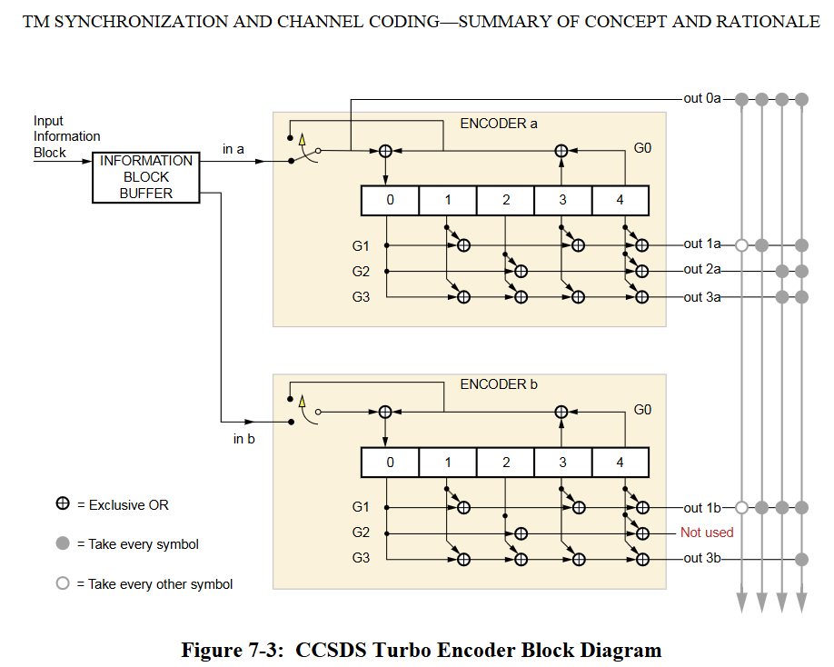

# You Asked:

如何理解这个系统RSC编码器状态归零的操作，是使用异或feedback来归零吗，请你详细分析

# Gemini Responded:

理解 RSC（递归系统卷积码）编码器的状态归零（Trellis Termination）是掌握 Turbo 码的关键。

在传统的卷积码中，归零很简单：只需要在信息位后面输入 $K-1$ 个“0”即可将寄存器清空。但对于 **RSC（递归）** 编码器，由于存在**反馈支路**，即使你输入全“0”，寄存器内部的旧状态也会通过反馈不断循环，导致寄存器无法回到全 0 状态。

以下是针对你提供的 CCSDS 标准图示进行的详细分析：

---

### 1. 核心原理：异或逻辑的自消去特性
归零操作的核心在于利用异或运算的一个基本性质：
$$A \oplus A = 0$$
即：**任何数与自身异或的结果均为 0。**

在 RSC 编码器中，最左边的加法器（左侧第一个 $\oplus$）决定了进入寄存器第一级（Cell 0）的数值。
* **正常编码阶段**：该加法器的输入是“信息比特 $u_k$”和“反馈比特 $G0$”。进入寄存器的值是 $u_k \oplus G0$。
* **归零阶段**：我们要想办法让进入寄存器的值变成 $0$。根据上面的公式，只要让加法器的两个输入**完全相同**，输出就一定是 $0$。

### 2. 结合电路图的具体分析
请观察图中 **ENCODER a** 或 **ENCODER b** 输入端的那个**开关（Switch）**：

1.  **信息位处理阶段（$k$ 个比特）**：
    开关拨向上方（连接 `in a`）。此时，外部信息比特进入编码器，与反馈支路 $G0$ 异或。
2.  **归零阶段（$K-1 = 4$ 个比特）**：
    当最后一位信息位处理完后，**开关向下拨**（连接到反馈支路 $G0$）。
    * 此时，最左侧加法器的两个输入端接收到的都是**同一个信号**：反馈比特 $G0$。
    * 加法器输出 = $G0 \oplus G0 = 0$。
    * 这个 $0$ 被送入第一个存储单元（Cell 0）。

### 3. 状态是如何清零的？
* **第 1 个归零周期**：反馈 $G0$ 与自身异或产生 $0$ 进入 Cell 0；原寄存器中的值向右移位。
* **第 2 个归零周期**：此时反馈支路 $G0$ 产生的数值是基于寄存器当前状态的（虽然已经变了），但开关依然将其反馈回来与自身异或，再次产生 $0$ 进入 Cell 0。
* **以此类推**：经过 $K-1$（图中 $K=5$，所以是 4 次）个周期后，连续进入的 4 个 $0$ 就会把寄存器中原本残留的“脏数据”全部挤出去。
* **最终结果**：4 个存储单元全部变为 $0$。

### 4. 为什么文中说“输出非零编码符号”？
图中文字提到：*“in the interim, the encoder continues to output nonzero encoded symbols.”*

这是因为在归零的这 4 个周期内：
* 虽然进入寄存器最左端的是 $0$，但寄存器内部原有的值在向右移动的过程中，依然会通过 $G1, G2, G3$ 支路参与异或运算生成输出比特（`out 1a, 2a, 3a`）。
* 这些输出比特被称为 **Tail Bits（尾比特）**。它们对于解码器（如 MAP/SOVA 算法）至关重要，因为它们告诉解码器：编码结束时，格图（Trellis）确实回到了全 0 状态。

### 总结
你直觉很准，**确实是使用异或反馈来归零的**。

* **操作方法**：断开外部输入，将编码器的**反馈值直接接回输入端**。
* **物理本质**：强制让输入加法器执行 $FB \oplus FB$（反馈异或反馈），从而源源不断地产生 $0$ 压入寄存器链条，直到把寄存器“洗干净”为止。

这就是为什么图中那个小开关是理解 RSC 终止操作的“灵魂”所在。

---

**你想深入了解一下这些“尾比特”在接收端解码时是如何被利用的吗？或者需要我帮你推导一下这个 $K=5$ 编码器的生成多项式？**

---

